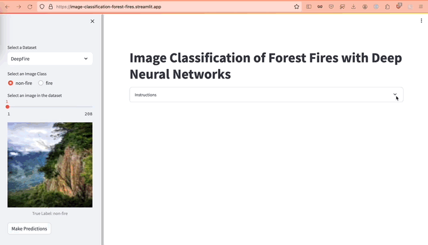

# Image Classification of Forest Fires with Deep Neural Networks
In this project I use pre-trained Computer Vision Models to perform image classification of Forest Fires. 

## Project Motivation
According to the BC government[^1], about 40% of forest fires are reported by the general public, in addition to other detection strategies such as:
- Air patrols
- Fire warden ground patrols
- Infrared technology
- Computer technology and predictive software
- Lookout towers

If not detected and managed early on, forest fires can become a very destructive event that impacts both remote communities and large urban centres alike. Considering the vastness of the territory in the province of BC and the low population density, it's not possible to have people in remote areas constantly monitoring, but rather autonomous vehicles (drones), satellite imagery, and optical systems. With the latter, there is an opportunity to use Deep Learning (DL) models for image classification and segmentation to enable early automated detection of fires. Some authors have reported 95% accuracy scores for DL models classifying forest fire images[^2].

Having reliable automated and early detection of fires can impact the response time and management before they become too large to control. This ensures safety for those living in immediate proximity, as well as the firefighter crews. Additionally, the financial burden on taxpayers overall could be reduced. Last year (2023) was the worst fire season on record, resulting in an overbudget of > $700 M for the provincial government in BC[^3].

## Datasets
For more details see [Datasets](https://github.com/bcrodrigo/capstone_project/blob/main/references/Dataset_Details.md).

## Workflow
**Image Preprocessing**
1. Image cleaning (check formatting, number of channels)
2. Resize images to 250 x 250 pixels
3. Create annotations file (`csv` with image names and true labels)

**Instantiate Datasets and DataLoaders**
1. Create Dataset (custom PyTorch class)
2. Obtain statistics (mean, standard deviation) for Training Dataset
3. Define transformations 
	- Resizing
	- Normalization (map images from [0, 255] to [-1,1])
4. Create DataLoader for Training and Validation Dataset
	- Specify batch size and shuffling

**Perform Transfer Learning**
1. Download model weights from `torchvision.models` [subpackage](https://pytorch.org/vision/stable/models.html)
2. Freeze all layers
3. Replace last fully-connected layer to output only 2 classes (non-fire and fire)

**Training and Model Evaluation**
1. Train classifying layer and evaluate model with binary classification metrics

For additional details, please see the `jupyter_notebook` folder for more [details](https://github.com/bcrodrigo/capstone_project/blob/main/jupyter_notebooks/Notebook_Details.md).

## Project Outcomes
Using the PyTorch library, I performed transfer learning with VGG19 and ResNet18. With only CPU calculations I was able to reproduce the binary classification results as reported in the literature in references [^2] and [^4] listed below. 

**Table 1:** Binary classification results for VGG19 and ResNet18 trained with the [DeepFire Dataset](https://www.kaggle.com/datasets/alik05/forest-fire-dataset)

|  Metric   | VGG19 reported in [^2] | VGG19  | ResNet18 |
| :-------: | :--------------------: | :----: | :------: |
| Accuracy  |         0.9500         | 0.9763 |  0.9789  |
| Precision |         0.9572         | 0.9641 |  0.9643  |
|  Recall   |         0.9421         | 0.9895 |  0.9947  |
| F1 score  |         0.9496         | 0.9766 |  0.9793  |
| AUC score |         0.9889         | 0.9763 |  0.9789  |

**Table 2:** Binary classification results for VGG19 and ResNet18 trained in the [WildFire Dataset](https://www.kaggle.com/datasets/elmadafri/the-wildfire-dataset/data)

|  Metric   | MobileNetV3 reported in [^4] | VGG19  | ResNet18 |
| :-------: | :--------------------------: | :----: | :------: |
| Accuracy  |            0.8405            | 0.8512 |  0.8610  |
| Precision |            0.8322            | 0.8267 |  0.8400  |
|  Recall   |            0.7799            | 0.7799 |  0.7925  |
| F1 score  |            0.8049            | 0.8026 |  0.8155  |
| AUC score |            0.8397            | 0.8381 |  0.8484  |

## Online Streamlit App


Follow [this link](https://image-classification-forest-fires.streamlit.app/) to see a deployed Streamlit app showcasing the predictions of the models, on images from different datasets.

## Directory Structure
```bash
.
├── LICENSE
├── README.md
├── jupyter_notebooks/
├── model_demo/
├── pytorch_environment.yml
├── references/
├── reports/
├── requirements.txt
├── src/
│   ├── data/
│   ├── models/
│   └── visualization/
└── streamlit_online_app.py
```

## Environment Installation
1. Download or clone the project and change to the project directory
2. Create a virtual environment from the `pytorch_environment.yml`  file as follows
```bash
conda env create -n my_new_env -f pytorch_environment.yml
```
**NOTE:** The `requirements.txt` file is intended to list the dependencies of `streamlit_online_app.py`

3. Download the image datasets from kaggle. Please see the following file for details of the specific [Datasets](https://github.com/bcrodrigo/capstone_project/blob/main/references/Dataset_Details.md) used in this project.
4. See the `jupyter_notebooks` folder for more [details](https://github.com/bcrodrigo/capstone_project/blob/main/jupyter_notebooks/Notebook_Details.md) on the preprocessing steps and the expected directory structure.

## Work In Progress
- [ ] Uploading trained models
- [ ] Implement device selection (CPU, GPU, MPS).
- [ ] Implement more scripting and automation

## Next Steps
- Explore additional training strategies
	- Multiclass classification (→ need to rebalance/augment WildFire dataset)
	- Fine-tuning
	- Hierarchical structure classification
- Experiment with Vision Transformers

## References
[^1]: https://www2.gov.bc.ca/gov/content/safety/wildfire-status/wildfire-response/how-wildfire-is-detected
[^2]: A. Khan, B. Hassan, S. Khan, R. Ahmed and A. Adnan, *DeepFire: A Novel Dataset and Deep Transfer Learning Benchmark for Forest Fire Detection* Mobile Information System, vol. 2022, pp. 5358359, 2022 [doi](https://doi.org/10.1155/2022/5358359).
[^3]: https://vancouver.citynews.ca/2023/09/27/bc-projected-deficit-2023-q1/
[^4]: El-Madafri I, Peña M, Olmedo-Torre N. *The Wildfire Dataset: Enhancing Deep Learning-Based Forest Fire Detection with a Diverse Evolving Open-Source Dataset Focused on Data Representativeness and a Novel Multi-Task Learning Approach.* Forests. 2023; 14(9):1697.  [doi](https://doi.org/10.3390/f14091697)